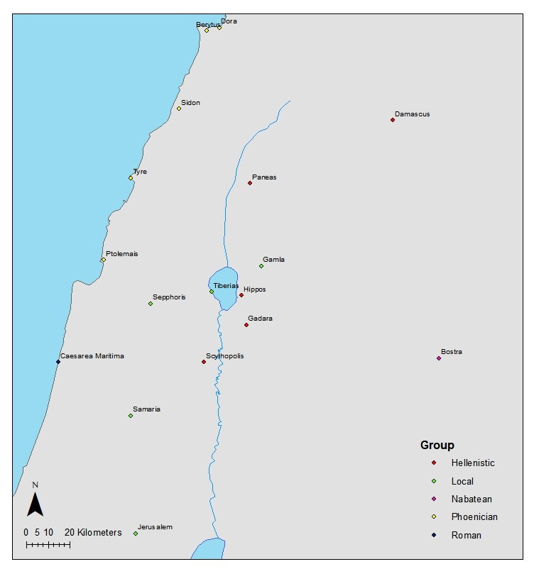

Introduction
==================

This visualisation explores the distribution of numismatic finds from five archaeological sites located in Israel, for the Early Roman Period. A total of 6 348 coins, found in five differents sites, are considered.

The sites used are: 

* Capernaum: A small Jewish fishing town. At this period it was not a site of particular economic or political importance, although Christian tradition considers it the hometown of the apostle Peter. Inhabitation continued until the VIII century CE.
* Gamla: A fortified Jewish town. It was destroyed in the Great Jewish Revolt of 66-70 CE and never recovered. This sudden end means that most finds come from it.
* Hippos: A Greek city. It had uneasy relations with its Jewish neigbours and was part of a loose confederacy of Hellenistic cities called the Decapolis. Inhabitation continued until the VIII century CE.
* Magdala: A Jewish fishing town, famous for its salted fish exports which were greatly appreciated in Rome. Considered the birthplace of Mary Magdalene. After the Great Jewish Revolt it decayed and was abandoned between the III and IV centuries CE.
* Tiberias: A city founded in 19 CE as the capital of the area.Although it was built accoridng to Roman standards, most of its population was composed of observant Jews. Inhabitation continues to this date.

The first tab divides the provenance of the coins into cultural groups, according to the city in which they were minted:

* Hellenistic: Those cities of predominantly Greek culture. Most are located in the Levant, but a few coins come from Greece itself.
* Local: Cities in the province of Judaea in which the majority of the population was observant Jewish.
* Nabatean: Cities which had previously belonged to the Kingdom of Nabatea and had recently been incorporated into Roman administration.
* Parthian: Coins that come from Gaba (modern Isfahan), capital of the Parthian empire.
* Phoenician: Cities from Akko-Ptolemais to Berytus, the centre of Phoenician culture.
* Roman: Cities of Roman culture. Only includes Rome itself and Caesarea Maritima, centre of Roman administration for the province.

The second tab establishes the network between the sites and the mints.  The third one presents a network of the cultures of said sites.

The fourth and fifth tabs present two maps in which the location of each mint and site is marked, a large scale one, and another that centres on the Levant.

The coins
==================

Row 
-------------------------------------
    
### Coins per Group (With those of Unkwnown Origin)
    
```{r}
library(tidyverse)
library(plotly)
library(magick)
library(igraph)
library(rgl)
library(networkD3)
library(threejs)
library(visNetwork)

coins <- read.csv("coins.csv")

all_coins <- ggplot(coins) +
  geom_bar(aes(City, 
               fill = Group), 
           position = "fill") +
  theme_bw() +
   labs(x = "City",
       y = "Percentage") 

(all_coins <- ggplotly(all_coins))
```
   
### Coins per Group (Without those of unknown origin)
    
```{r}

no_unknown <- subset(coins, Group != "Unknown")

not_all_coins <- ggplot(no_unknown) +
  geom_bar(aes(City, 
               fill = Group), 
           position = "fill") +
  theme_bw() +
   labs(x = "City",
       y = "Percentage")

(not_all_coins <- ggplotly(not_all_coins))

```   

Row {.tabset .tabset-fade}
-------------------------------------
   
### Coins found in Capernaum 


```{r}

capernaum <- subset(coins, City == "Capernaum")

coins_capernaum <- ggplot(capernaum) +
  geom_bar(aes(Group,
               color = Group,
               fill = Group)) +
  theme_bw() +
   labs( x = "City",
       y = "N")

(coins_capernaum <- ggplotly(coins_capernaum))
```   
 
### Coins found in Gamla
    
```{r}
gamla <- subset(coins, City == "Gamla")

coins_gamla <- ggplot(gamla) +
 geom_bar(aes(Group,
               color = Group,
               fill = Group)) +
  theme_bw() +
   labs( x = "City",
       y = "N")

(coins_gamla <- ggplotly(coins_gamla))
```

### Coins found in Hippos
    
```{r}

hippos <- subset(coins, City == "Hippos")

coins_hippos <- ggplot(hippos) +
 geom_bar(aes(Group,
               color = Group,
               fill = Group)) +
  theme_bw() +
   labs( x = "City",
       y = "N")

(coins_hippos <- ggplotly(coins_hippos))

```

### Coins found in Magdala
    
```{r}

magdala <- subset(coins, City == "Magdala")

coins_magdala <- ggplot(magdala) +
  geom_bar(aes(Group,
               color = Group,
               fill = Group)) +
  theme_bw() +
   labs( x = "City",
       y = "N")

(coins_magdala <- ggplotly(coins_magdala))

```

### Coins found in Tiberias
    
```{r}

tiberias <- subset(coins, City == "Tiberias")

coins_tiberias <- ggplot(tiberias) +
 geom_bar(aes(Group,
               color = Group,
               fill = Group)) +
  theme_bw() +
   labs( x = "City",
       y = "N")

(coins_tiberias <- ggplotly(coins_tiberias))
```

Networks 
==================

Column
-------------------------------------

### Network of mints and sites

This visualisation presents the coin finds in those 5 archaeological sites in Northen Israel. Yellow nodes represent mints where coins were made, gray nodes represent some of the 5 sites where the coins were found, but none were minted, and red nodes represent sites that both are a location of finds and had a mint. Hovering over each node will tell the name of the city.

```{r}

coins <- read.csv("coins.csv") %>%
  subset(Mint != "Uncertain")

df <- data.frame(coins$Mint, coins$City)


g <- get.adjacency(graph.edgelist(as.matrix(df), directed = FALSE))

g2 <- graph.adjacency(g, mode = "undirected", weighted = TRUE)


nodes <- read_csv("nodes.csv")

links <- read_csv("edges.csv")

nodes$shape <- "dot"  
nodes$shadow <- TRUE 
nodes$title <- nodes$city 
nodes$label <- nodes$type.label 
nodes$size <- 25
nodes$borderWidth <- 2 
nodes$color.background <- c("slategrey", "gold", "tomato")[nodes$type]
nodes$color.highlight.background <- "orange"
nodes$color.highlight.border <- "darkred"
nodes$color.border <- "black"


(net <-  visNetwork(nodes, links)  %>%
  visOptions(selectedBy = "label", 
             highlightNearest = TRUE) %>%
  visPhysics(stabilization = FALSE))

```


Column
-------------------------------------


### Network of cultures

In contrast to the previous visualisation, this one centres on the culture of the site in which the coins were found or produced.

```{r}


nodes2 <- read_csv("nodesculture.csv")

nodes2$shape <- "dot"  
nodes2$shadow <- TRUE 
nodes2$title <- nodes2$city 
nodes2$label <- nodes2$type.label 
nodes2$size <- 25
nodes2$borderWidth <- 2 
nodes2$color.background <- c("slategrey", "gold", "tomato", "green", "blue", "purple")[nodes2$type]
nodes2$color.highlight.background <- "orange"
nodes2$color.highlight.border <- "darkred"
nodes2$color.border <- "black"


(net2 <-  visNetwork(nodes2, links)  %>%
  visOptions(selectedBy = "label", 
             highlightNearest = TRUE) %>%
  visPhysics(stabilization = FALSE))


```


Large Scale Map
==================


Map of the Levant
==================


