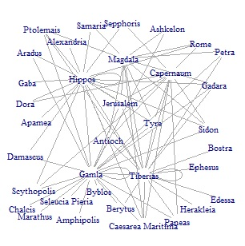
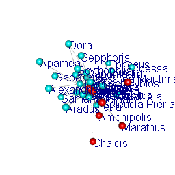

The coins
==================

Row 
-------------------------------------
    
### Coins per Group (With those of Unkwnown Origin)
    
```{r}
library(tidyverse)
library(plotly)
library(magick)
library(igraph)
library(rgl)
library(networkD3)
library(threejs)

coins <- read.csv("coins.csv")

all_coins <- ggplot(coins) +
  geom_bar(aes(City, 
               fill = Group), 
           position = "fill") +
  theme_bw() +
   labs(x = "City",
       y = "Percentage") 

(all_coins <- ggplotly(all_coins))
```
   
### Coins per Group (Without those of unknown origin)
    
```{r}

no_unknown <- subset(coins, Group != "Unknown")

not_all_coins <- ggplot(no_unknown) +
  geom_bar(aes(City, 
               fill = Group), 
           position = "fill") +
  theme_bw() +
   labs(x = "City",
       y = "Percentage")

(not_all_coins <- ggplotly(not_all_coins))

```   

Row {.tabset .tabset-fade}
-------------------------------------
   
### Coins found in Capernaum 

```{r}

capernaum <- subset(coins, City == "Capernaum")

coins_capernaum <- ggplot(capernaum) +
  geom_bar(aes(City,
               fill = Group)) +
  theme_bw() +
   labs( x = "City",
       y = "N")

(coins_capernaum <- ggplotly(coins_capernaum))
```   
 
### Coins found in Gamla
    
```{r}
gamla <- subset(coins, City == "Gamla")

coins_gamla <- ggplot(gamla) +
  geom_bar(aes(City,
               fill = Group)) +
  theme_bw() +
   labs( x = "City",
       y = "N")

(coins_gamla <- ggplotly(coins_gamla))
```

### Coins found in Hippos
    
```{r}

hippos <- subset(coins, City == "Hippos")

coins_hippos <- ggplot(hippos) +
  geom_bar(aes(City,
               fill = Group)) +
  theme_bw() +
   labs( x = "City",
       y = "N")

(coins_hippos <- ggplotly(coins_hippos))

```

### Coins found in Magdala
    
```{r}

magdala <- subset(coins, City == "Magdala")

coins_magdala <- ggplot(magdala) +
  geom_bar(aes(City,
               fill = Group)) +
  theme_bw() +
   labs( x = "City",
       y = "N")

(coins_magdala <- ggplotly(coins_magdala))

```

### Coins found in Tiberias
    
```{r}

tiberias <- subset(coins, City == "Tiberias")

coins_tiberias <- ggplot(tiberias) +
  geom_bar(aes(City,
               fill = Group)) +
  theme_bw() +
   labs( x = "City",
       y = "N")

(coins_tiberias <- ggplotly(coins_tiberias))
```

Each site and its network
==================

Row 
-------------------------------------

### Network of all sites

```{r}

coins <- read.csv("coins.csv") %>%
  subset(Mint != "Uncertain")

df <- data.frame(coins$Mint, coins$City)


g <- get.adjacency(graph.edgelist(as.matrix(df), directed = FALSE))

g2 <- graph.adjacency(g, mode = "undirected", weighted = TRUE)


gtk <- tkplot(g2)

lg <- tkplot.getcoords(gtk)

netg <- plot(g2, layout=lg,
     vertex.shape="none",
     vertex.label.degree=-pi/2,
     vertex.label.dist=0,
     vertex.label.cex=0.7)

```




### 3d animation



Row {.tabset .tabset-fade}
-------------------------------------

### Capernaum's network

```{r, Capernaum}

capernaum <- subset(df, coins.City == "Capernaum")

capernaum1 <-   get.adjacency(graph.edgelist(as.matrix(capernaum), directed = FALSE))

capernaum2 <- graph.adjacency(capernaum1, mode = "undirected", weighted = TRUE)

plot(capernaum2, 
     asp=0,
     vertex.shape="none",
     vertex.label.cex=0.8)

```

### Gamla's network

```{r, Gamla}

gamla <- subset(df, coins.City == "Gamla")

gamla1 <-   get.adjacency(graph.edgelist(as.matrix(gamla), directed = FALSE))

gamla2 <- graph.adjacency(gamla1, mode = "undirected", weighted = TRUE)


gamlatk <- tkplot(gamla2)

lgamla <- tkplot.getcoords(gamlatk)

plot(gamla2, layout=lgamla,
     vertex.shape="none",
     vertex.label.degree=-pi/2,
     vertex.label.dist=0)

```

### Hippos' network

```{r, Hippos}

hippos <- subset(df, coins.City == "Hippos")

hippos1 <-   get.adjacency(graph.edgelist(as.matrix(hippos), directed = FALSE))

hippos2 <- graph.adjacency(hippos1, mode = "undirected", weighted = TRUE)

plot(hippos2, 
     asp=-5,
     vertex.shape="none",
     vertex.label.cex=0.8)

```

### Magdala's Network

```{r, Magdala}

magdala <- subset(df, coins.City == "Magdala")

magdala1 <-   get.adjacency(graph.edgelist(as.matrix(magdala), directed = FALSE))

magdala2 <- graph.adjacency(magdala1, mode = "undirected", weighted = TRUE)

plot(magdala2, 
     asp=-5,
     vertex.shape="none",
     vertex.label.cex=0.8)

```

### Tiberia's Network

```{r, Tiberias}

tiberias <- subset(df, coins.City == "Tiberias")

tiberias1 <-   get.adjacency(graph.edgelist(as.matrix(tiberias), directed = FALSE))

tiberias2 <- graph.adjacency(tiberias1, mode = "undirected", weighted = TRUE)

plot(tiberias2, 
     asp=-5,
     vertex.shape="none",
     vertex.label.cex=0.8)

```

Map
==================
